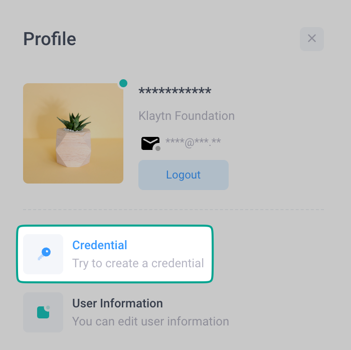
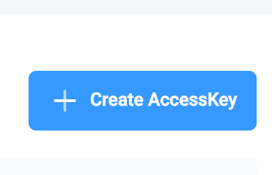

# Using Klaytn API Service — Baobab

This document explains how to deploy the contracts using Klaytn API Service (KAS).

## 1. Prepare a Private Key w/ testnet KLAY

- Obtain testnet KLAY from the [Baobab Faucet](https://baobab.wallet.klaytn.com/faucet).

## 2. Set up KAS

1. Create an account on the [KAS Console](https://console.klaytnapi.com).

2. Create credentials for the project.

Click **Profile** at top right:


Click **Credential**:



Click **Create AccessKey**:



## 3. Paste credentials into `.env` file

```bash
cp .env.example .env
```

Then edit .env:

```bash
TESTNET_PRIVATE_KEY=<PrivateKey>
KAS_ACCESS_KEY_ID=<AccessKey_Id>
KAS_SECRET_ACCESS_KEY=<SecretAccessKey>
```

## 4. Deploy contracts

```bash
pnpm run deploy:kasBaobab
# or
pnpm run deploy --network kasBaobab
```
